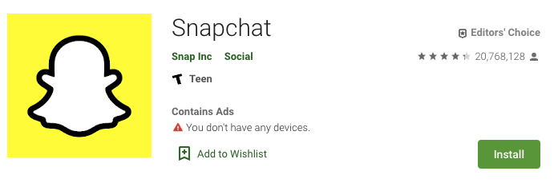
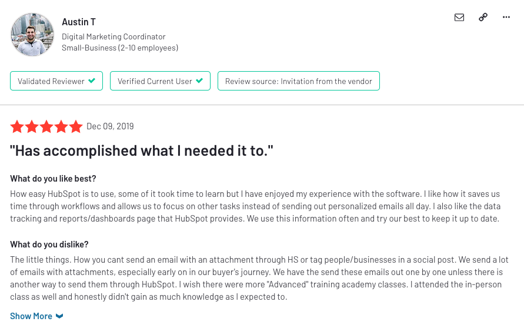
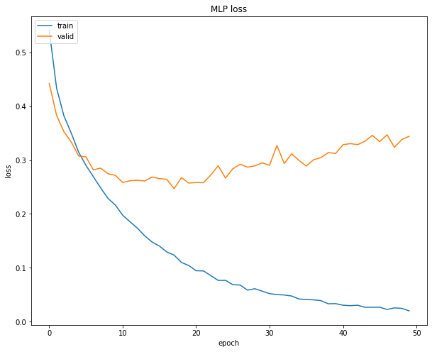
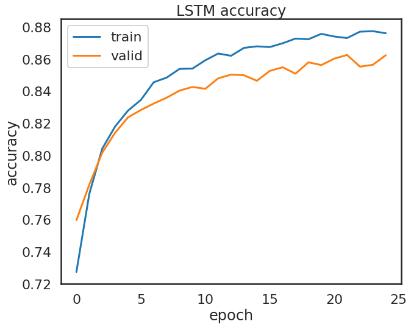
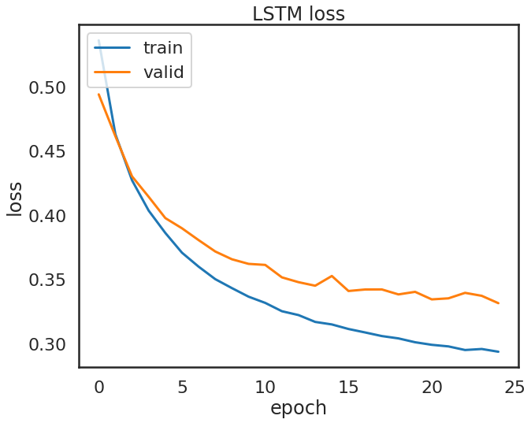
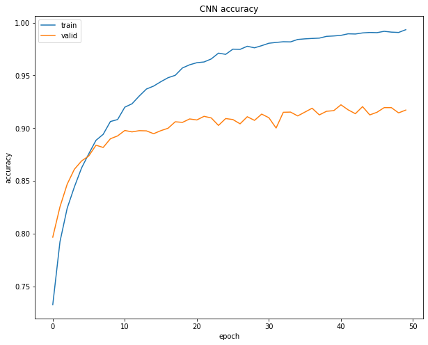
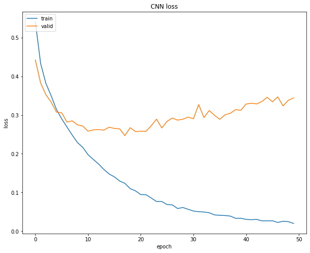
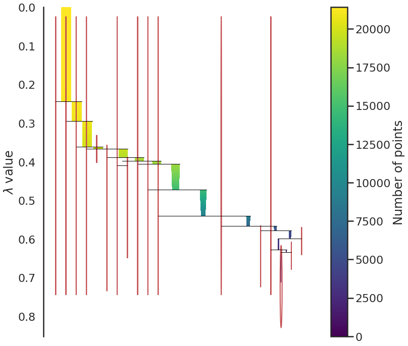
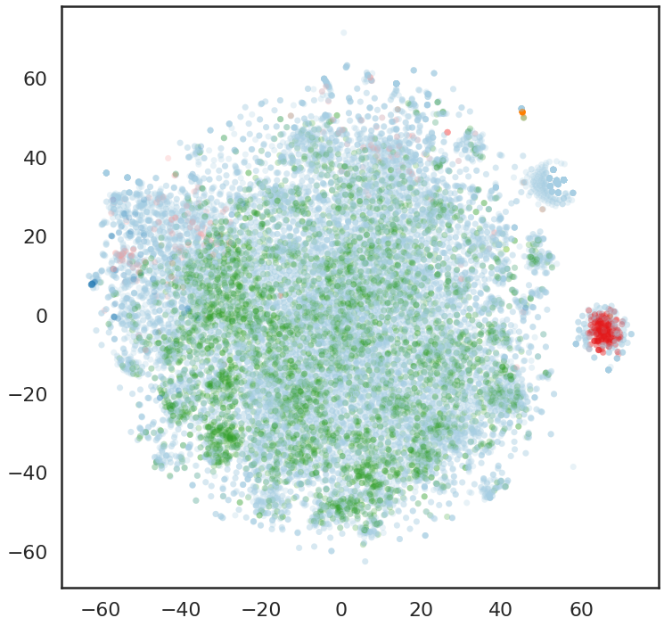

# Actionable Insights: Extracting Constructive Material from Customer Reviews
## Training a Neural Network to Recognize Text Information to Inform Product / Feature Development 

**IMAGE**

## README Contents
- [How to Navigate this Repository](#How-to-Navigate-this-Repository)
 - [Introduction](#Abstract)
 - [Methodology](#Methodology)
 - [CNN Modeling](#CNN-Modeling)
 - [Model Evaluation](#Model-Evaluation)
 - [Conclusions and Next Steps](#Conclusions-and-Next-Steps)
 - [Sources](#Sources)
 - [Acknowledgements](#Acknowledgements)

## How to Navigate this Repository
 - [**Data**](/Data): Containes review csv files  and pickels of dataframes
 - [**Images**](/Images): Contains all data visualizations and other images that appear in this repository
 - [**Code**](/Code): Jupyter Notebooks written in python.

## Introduction
 Product reviews can be an incredible resource for product managers, and companies as a whole, to measure customer satisfaction.  They can also be a window into features, bugs, and be incredibly informative to the direction of a product.  However, there is often a great deal of noise to be found in the reviews that will not be as informative.  Successful apps can have **millions of reviews**, and sifting through them can be overwhelming.  
 
 
 Reviews may be as simple as "Like", or contain paragraphs of valuable information and feature recomendations and user information.  The quality of review varies based on many factors, but here are some primary factors that I will consider in this project:
 
 - **The Venue**: Where is this review posted?
 - **The Reason**: Why is the user posting this review?
 - **The Product**: What kind of product is being reviewed?

**The Venue**: In examining various sources of user reviews, I found that they differed greatly depending on where the review was posted.  App store reviews are commonly written on a phone, and use more informal sms, emoji, and social media based vocabulary.  These tend to be shorter reviews, typically prompted by a popup shortly after downloading the app. 

Alternatively reviews for SaaS products on a site like [G2](https://G2.com) are typically written from a computer, respond to specific questions, and are typically longer and more detailed.  These are often written as a response to direct outreach requesting feedback from an email, or in app message, and are sometimes incentivised with a reward.

I will primarily be analysing G2 reviews of a particular product (Hubspot), because they are typically longer, written in paragraph form, and respond to a set of specific questions.

---

---

**The Reason**: A review can be written merely to keep a popup from recurring, or can be from a helpful perspective to honestly inform the company about the product.  They can be written to report issues, frustrations, or merely boost the review score of a product. 

 I will be training the model to identify only the most relevant and helpful sentences from the reviews that are actionable from the perspective of a product manager.
 

**The Product**: Physical products on a site like Amazon have very different review criteria than a software product.  Software products, in particular, are an interesting source of reviews due to the iterative nature of the medium.  A single user will see many versions of the same product over the lifetime of their use, and may even write multiple reviews depending on the version.  As opposed to a physical product (a chair, for instance), it is reasonable for a user to expect their suggestions might be implemented, potentially swiftly, and could even appear on an update of their product.

Software as a Service (SaaS) products are particularly interesting for several reasons:
- The customers (ex: companies) are not always the users (ex: employees)
- They typically have a range of functions
- They are typically expensive relative to consumer products, which can evoke a more thoughtful review and empower users to voice expectations.

Each product will differ with regards to the keywords and lexicon depending on the functionality and features it provides or is associated with.  In this project I will focus on Hubspot, which is a CRM and Marketing platform typically used by marketing, sales, and management teams.

## Methodology
To accomplish this categorization, I created a dataset of  5,447 reviews of [Hubspot](https://www.g2.com/products/hubspot/reviews) from G2.  The reviews answer 4 specific questions:

- **What do you like best?**
- **What do you dislike?**
- **What recommendations do you have to others considering the product?**
- **What problems are you solving with the product? What benefits have you realized?**

I separated the reviews into sentences, and vectorized the tokenized sentences using Spacy, which relies on the Glove word vector library.  The resulting 25,000 sentences were labeled as 'actionable', meaning that they contain information that could a product manager could act upon to imprtove the product.  For example:
- **Actionable**: "The downside for me is not being able to upload photos to a contact/company profile."
- **Not Actionable**: " It's also a really great tool for us to use internally. "

A CNN was trained on the labeled dataset.
 - **Baseline Score**
 - **Primary model score**
 - **Image of results of first model**

| Data Science Workflow       | Description                                                                                                                                                                         |
|-----------------------------|-------------------------------------------------------------------------------------------------------------------------------------------------------------------------------------|
| **Problem Statement**            | Customer reviews can be a valuable source of actionable insights to inform product development. But finding the actionable information in an overwhelming amount of text is challenging. How might I address this problem? Goal: Categorize sentences from reviews by building  a Convolutional Neural Network (CNN) to detect actionable insights.                         |
| **Data Acquisition**   | Using a spider crawling over reviews for Hubspot on G2.com, I collected 5,447 reviews, each answering 4 questions about the product.  The dataset could be augmented with additional products and reviews given more time. |
| **Data Processing** | I tokenized and vectorized the reviews into 20,874 sentences using the SpaCy API and the [GloVe](https://nlp.stanford.edu/projects/glove/) vocabulary and word vectors. I labeled the sentences as actionable or not.                                                                                              |
| **Modeling**                    | I used several models to categorize the actionable insights from the data including CNN, MLP, and LSTM with Baysian hyperparameter optimization.  To determine sub-categories within actionable sentences, I used DBSCAN and Tensorboard Projector. |
| **Assessing Predictions**                    | I visualized the probability of categorizing actionable insights for each sentence using an interactive tensorboard projector, scattertext, and predicted versus actual results. |

## Data 
The reviews were sentencized and tokenized using SpaCy.  Below you can see some distribution and frequency of words associated with actionable and non actionable insights within the reviews.

## Neural Networks

 I implemented 3 models that could predict actionable insights.  The most effective model was the MLP with 4 hidden layers of 512 neurons, with 0.2 dropout.  
 
### Model #1: MLP
- Train Accuracy: 99.34%
- Test Accuracy:  91.72%
- Assessment: Overfit

 
  
  
### Model #2: LSTM
- Train Accuracy: 88.88%
- Test Accuracy: 86.31%
- Assessment: Fit

   
    
    
### Model #3: CNN
- Train Accuracy: 71%
- Test Accuracy: 71.17%
- Assessment: Poor model

   
     
     
## Model Assessment
 
After running the models above, I tuned the hyperparameters using a Baysian hyperparameter optimization.  

Below we can see the scattertext plot of word frequency for actionable and non actionable insights within interviews.  The chart is interactive, try typing a word in the field to search relations and source sentences.
<figure class="video_container">
  <iframe src="Code/G2_actionable_word_scatter.html" width=1000px height=800px frameborder="0" allowfullscreen="true"> </iframe>
</figure> 

The words in the upper right may be good candidates to add to sopwords for this dataset since theyare frequent but do not aid in prediction.
## Sub-Categorization of Actionable Data
To determine if there were sub-categories within the data predicted to be actionable, I used several clustering models.  
- HDBSCAN
- Tensorboard

The HDBSCAN reduced the data from 300 to 2 dimensions.  The model suggested that there were 16 subcategories, but the clusters were not immediately clear.  

#### HDBSCAN Condensed Tree

#### HDBSCAN Soft Clusters

Cluster for which a given point has the highest probability of being in.

### Sub-Categorization with Tensorboard Projector
The 2D clustering of the HDBSCAN model was difficult to visualize.  To get a better sense of the sub-categories, I employed a 3D visualization using Tensorboard Projector using T-SNE for dimension reduction from 300 to 3.  
 
 

The tensorboard model is more descriptive in that you can explore the clusters an see details about shared attributes.  Here you can see the clear primary categorization of actionable (Red) and not-actionable (Blue) as well as some clusters.

## Conclustions and Next Steps

My main priorities in this project were to predict and classify whether a sentence from a given review contains actionable insights from the perspective of a product manager, and to sub-classify those actionable insights.  Although not all of the models I tested excelled at their task, I was able to accomplish both ulimately.  My biggest challenge with this data was labelling the data.  The models did not perform well unsupervised, so substantial time was spent labelling much of the data.  I used a combination of pre-trained and untrained models, and would like to explore further training the tensorboard model with more labeled data. 

I would like to increase the scope of this model to bring in reviews from a variety of sources for a given company, including Reddit, Twitter, and other review sites.  I would like to build a user interface and dashboard that would be easy to use for a product manager considering where to focus their attention.  
